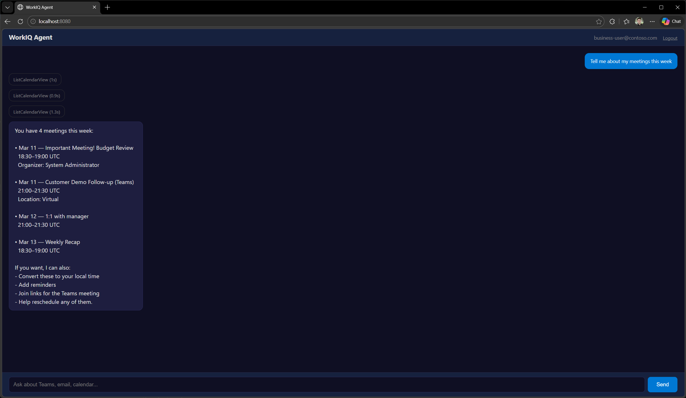
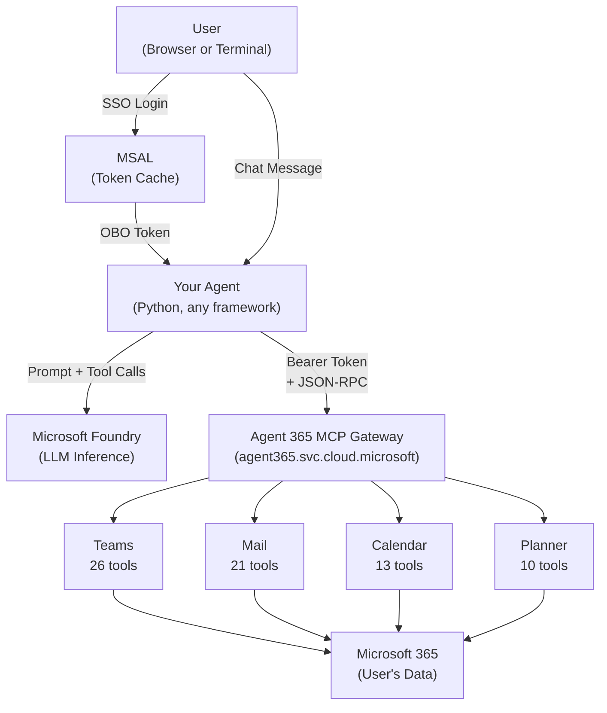

# workiq-mcp-auth

> **Disclaimer:** Provided diagrams, documents, and code are provided AS IS without warranty of any kind and should not be interpreted as an offer or commitment on the part of Microsoft, and Microsoft cannot guarantee the accuracy of any information presented. MICROSOFT MAKES NO WARRANTIES, EXPRESS OR IMPLIED, IN THIS DIAGRAM(s) DOCUMENT(s) CODE SAMPLE(s).

> **Sample notice:** This repository is a proof-of-capability sample that demonstrates delegated-user authentication and direct MCP connectivity to Agent 365 Work IQ servers from a custom Python agent. It is intended as a reference implementation for architecture and auth flow, not a production-ready web application. Customers should add production controls for session management, token-cache isolation, secret management, secure cookie configuration, CSRF protection, logging, monitoring, and deployment hardening before using this pattern in a live environment.

Custom Python agent that connects to [Agent 365 Work IQ MCP servers](https://learn.microsoft.com/en-us/microsoft-agent-365/tooling-servers-overview) for Microsoft 365 data access (Teams, Mail, Calendar, Planner) using delegated user identity and [Microsoft Agent Framework](https://github.com/microsoft/agent-framework) for LLM orchestration.

Work IQ MCP servers are standard HTTPS endpoints that accept JSON-RPC with a Bearer token. You can call them from any agent framework, any orchestration layer, or plain HTTP.

The official [Agent 365 SDK](https://learn.microsoft.com/en-us/microsoft-agent-365/developer/tooling) provides a managed integration path, but it ties you to the Microsoft 365 Agents SDK request model (`TurnContext`, `Authorization`, bot-framework channels).

This repo shows the alternative: acquire an OBO token with MSAL, pass it in an HTTP header, and call the MCP servers directly. Your agent code, your framework, your web stack.

Includes two server-side patterns: an OBO web app with SSO login and a terminal REPL with interactive auth. Both use `MCPStreamableHTTPTool` to connect to remote MCP servers with OAuth Bearer tokens and MSAL token caching for silent refresh.



## Architecture



## Prerequisites

| Requirement | Notes |
|-------------|-------|
| Python 3.10+ | |
| Microsoft Foundry project | With a deployed model |
| M365 Copilot license | Required for Work IQ data access |
| Entra ID App Registration | With Agent 365 API permissions |
| Global Admin (one-time) | To create the Agent 365 service principal |

## Quick Start

### 1. Clone and install

```bash
git clone https://github.com/nicksangeorge/workiq-mcp-auth.git
cd workiq-mcp-auth

python -m venv .venv
.venv\Scripts\activate        # Windows
# source .venv/bin/activate   # macOS/Linux

pip install -r requirements.txt
```

### 2. Configure environment

```bash
cp .env.example .env
# Edit .env with your Foundry and App Registration details
```

| Variable | Description |
|----------|-------------|
| `AZURE_AI_PROJECT_ENDPOINT` | Microsoft Foundry project endpoint |
| `AZURE_AI_API_KEY` | API key for the Foundry project |
| `AZURE_AI_MODEL_DEPLOYMENT_NAME` | Model deployment name |
| `A365_CLIENT_ID` | App Registration client ID |
| `A365_CLIENT_SECRET` | Client secret (OBO mode only) |
| `A365_TENANT_ID` | Entra ID tenant ID |

### 3. Tenant setup (one-time, requires Global Admin)

```bash
# Create the Agent 365 service principal
az ad sp create --id "ea9ffc3e-8a23-4a7d-836d-234d7c7565c1"

# Note the SP object ID from the output, set it in .env as A365_SP_ID

# Create your app registration
az ad app create --display-name "WorkIQ-MCP-Agent" --sign-in-audience "AzureADMyOrg"
# Note the appId and id from output, set them in .env

# Add redirect URI and client secret
az ad app update --id <APP_OBJECT_ID> --web-redirect-uris "http://localhost:8080/auth/callback"
az ad app credential reset --id <APP_OBJECT_ID> --append

# Run the permissions + admin consent setup
python setup_a365.py
```

### 4. Verify LLM connectivity

```bash
python test_llm.py
```

### 5. Run the agent

**OBO Web Agent** (reference sample for delegated auth and SSO):
```bash
python agent_obo.py
# Open http://localhost:8080
```

The web UI streams tool-call events in real time (shows which MCP tool is being called and how long it takes) and includes session logout.

**Interactive REPL** (testing):
```bash
python agent_server.py --mode interactive
```

## How It Works

The agent connects to Agent 365 Work IQ MCP servers over HTTPS using `MCPStreamableHTTPTool` from `agent-framework`. Auth tokens come from MSAL (either interactive browser login or OBO exchange).

The `MCPStreamableHTTPTool` requires an `httpx.AsyncClient` with the Bearer token set in headers. The `headers=` constructor parameter does not forward auth headers to the transport; you must use `http_client=` instead.

```python
import httpx
from agent_framework import MCPStreamableHTTPTool

http_client = httpx.AsyncClient(
    headers={"Authorization": f"Bearer {access_token}"},
    timeout=httpx.Timeout(60.0),
)

mcp_tool = MCPStreamableHTTPTool(
    name="WorkIQ-Teams",
    url="https://agent365.svc.cloud.microsoft/agents/servers/mcp_TeamsServer",
    http_client=http_client,
    approval_mode="never_require",
    load_prompts=False,
)
```

### OBO Flow (agent_obo.py)

1. User visits `/login`, gets redirected to Entra ID
2. After sign-in, the server exchanges the auth code for user tokens via `ConfidentialClientApplication`
3. Server calls `acquire_token_on_behalf_of()` to get an Agent 365-scoped token
4. Agent connects to MCP servers with the OBO token
5. MSAL caches the token and refreshes it silently on subsequent requests

### Available MCP Servers

| Server | Endpoint | Scope | Tools |
|--------|----------|-------|-------|
| Teams | `mcp_TeamsServer` | `McpServers.Teams.All` | 26 |
| Mail | `mcp_MailTools` | `McpServers.Mail.All` | 21 |
| Calendar | `mcp_CalendarTools` | `McpServers.Calendar.All` | 13 |
| Planner | `mcp_PlannerServer` | `McpServers.Planner.All` | 10 |

All endpoints are at `https://agent365.svc.cloud.microsoft/agents/servers/<name>`.

The Agent 365 API resource ID is `ea9ffc3e-8a23-4a7d-836d-234d7c7565c1`. This is a Microsoft first-party application; the scope GUIDs are the same in every tenant.

## Project Structure

```
workiq-mcp-auth/
  agent_obo.py           # OBO web agent: FastAPI + SSO + chat UI
  agent_server.py        # Interactive REPL agent with MSAL browser login
  agent.py               # Local agent using WorkIQ MCP over stdio (legacy)
  setup_a365.py          # One-time: adds API permissions + grants admin consent
  test_remote_mcp.py     # Validates connectivity to all 4 MCP servers
  test_llm.py            # LLM connectivity smoke test
  requirements.txt       # Python dependencies
  .env.example           # Template environment config
  .gitignore             # Excludes .env, .venv, __pycache__
```

## Technology Stack

| Layer | Technology |
|-------|------------|
| LLM | Microsoft Foundry (any deployed model) |
| Agent Framework | [Microsoft Agent Framework](https://github.com/microsoft/agent-framework) (`agent-framework` package) |
| M365 Tools | [Agent 365 Work IQ MCP Servers](https://learn.microsoft.com/en-us/microsoft-agent-365/tooling-servers-overview) |
| Auth | MSAL (interactive + OBO), Entra ID |
| Web | FastAPI + Uvicorn (OBO mode) |
| MCP Transport | `MCPStreamableHTTPTool` over Streamable HTTP/SSE |

## Known Issues

- `MCPStreamableHTTPTool` ignores the `headers=` constructor parameter. Pass an `httpx.AsyncClient` via `http_client=` instead.
- MCP session termination returns HTTP 400. This is cosmetic and does not affect tool calls.
- Multi-tenant apps require admin consent in each tenant. The tenant admin must grant consent for the Agent 365 scopes before users in that tenant can authenticate.
- The current web sample creates fresh MCP connections per chat request and uses sample-grade session handling. For customer deployments, implement per-session token-cache isolation, server-side session storage, hardened cookie settings, and connection/session lifecycle controls.
- For production deployments, prefer certificate-based confidential-client credentials or managed-identity-backed designs instead of long-lived client secrets.

## References

| Resource | Link |
|----------|------|
| Work IQ MCP overview | [tooling-servers-overview](https://learn.microsoft.com/en-us/microsoft-agent-365/tooling-servers-overview) |
| Agent 365 SDK tooling | [developer/tooling](https://learn.microsoft.com/en-us/microsoft-agent-365/developer/tooling) |
| MCPStreamableHTTPTool API | [agent_framework.mcpstreamablehttptool](https://learn.microsoft.com/en-us/python/api/agent-framework-core/agent_framework.mcpstreamablehttptool) |
| MCP tools with Foundry Agents | [agents/tools/hosted-mcp-tools](https://learn.microsoft.com/en-us/agent-framework/agents/tools/hosted-mcp-tools) |
| Agent 365 SP setup script | [New-Agent365ToolsServicePrincipalProdPublic.ps1](https://github.com/microsoft/Agent365-devTools/blob/main/scripts/cli/Auth/New-Agent365ToolsServicePrincipalProdPublic.ps1) |
| Agent 365 Samples | [Agent365-Samples](https://github.com/microsoft/Agent365-Samples) |

## License

MIT
